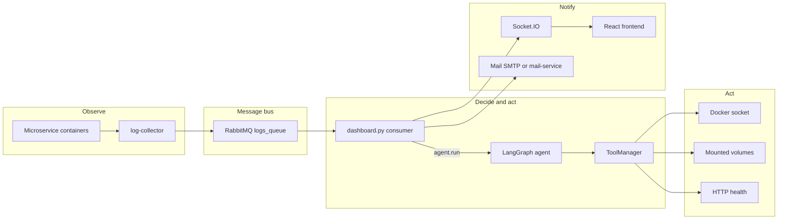

# Detailed presentation guide — theory, steps, and five-speaker script

**Audience:** Engineers and stakeholders who need a deep walkthrough of the microservices failure-detection stack.

**Companion doc:** This file is the **long-form, pedagogical** version. For a shorter overview with the same five-way split, see [EXPLANATION.md](EXPLANATION.md). Use **EXPLAINATION.md** for rehearsal scripts and theory; use **EXPLANATION.md** for a quick handout.

---

## Five-speaker roster

| Speakers | Role | Primary codebase |
|----------|------|-------------------|
| **Speaker A** | AI engine — graph, LLM, prompts, JSON, coercion, fix-code payload | `ai_engine/agent.py` |
| **Speaker B** | Incidents, classifier, tools, Docker actuators, verification | `ai_engine/state.py`, `ai_engine/tools.py` (optional: `consumer.py`) |
| **Speaker C** | LLM research/config, React UI, email pipeline | Env + providers; `frontend/`; `mail-service/`; email paths in `dashboard.py` |
| **Speaker D** | Log pipeline, RabbitMQ, Compose topology, container naming | `log-collector/index.js`, `docker-compose.yml`, service list |
| **Speaker E** | Dashboard bridge, analysis gate, code context, demo services | `dashboard.py`, `hil-db-demo/`, `buggy-service/` |

**Suggested pairing for rehearsal:** A+B (ai_engine) together; D+E (platform) together; C solo.

---

## Section 1 — End-to-end pipeline (every presenter should know this)

The system implements **observe → gate → decide → act → verify → notify**, aligned with **AIOps** and **closed-loop remediation**. The gate and policy layers exist so you do not run an LLM on every log line.

### Numbered steps (with theory)

1. **Application processes write logs**  
   Services print to stdout/stderr; Flask/Werkzeug may add access lines (e.g. `500`). **Theory:** Centralized logging assumes **standard streams** or structured logs; Docker captures both.

2. **log-collector tails each container**  
   For each service name in its list, it runs Docker APIs, reads log chunks, and attaches `container_status` / `exit_code`. **Theory:** This is a **daemon/sidecar** pattern—apps stay unchanged; observability is centralized.

3. **JSON batches publish to RabbitMQ**  
   Each message is one batch: `{ service, timestamp, container_status, exit_code, logs: [lines...] }`. **Theory:** **Message queues** decouple **fast producers** (logs) from **slower consumers** (dashboard + AI). Backpressure and durability depend on queue settings.

4. **ai-engine runs `dashboard.py` as the main process**  
   A background thread connects to RabbitMQ with `basic_qos(prefetch_count=1)` and `basic_consume`. **Theory:** Prefetch limits in-flight work per consumer; **ack after processing** avoids losing messages on crash mid-handler.

5. **Every message updates in-memory state and pushes Socket.IO**  
   `new_log` and `status_update` go to browsers. **Theory:** This is **event-sourced UI** at small scale—in-memory state is enough for a demo; production might use a DB or stream.

6. **`_needs_analysis(logobj)` gates expensive work**  
   Triggers on non-zero exit code, `_FAILURE_KEYWORDS`, or extra markers (`[code_heal]`, Werkzeug ` 500 -`). **Theory:** **Dual pipeline**—show everything vs. run LLM—reduces cost and noise. Without markers, benign lines that omit the word “error” would never trigger analysis.

7. **Per-service cooldown**  
   After a trigger, further analyses for that service wait `ANALYSIS_COOLDOWN` seconds. **Theory:** Prevents **thrashing** when logs spam the same failure.

8. **`_load_code_context` for code-heal services**  
   For services in `CODE_HEAL_SERVICES`, files under `CODE_HEAL_ROOT` (e.g. `app.py`) are read into a dict passed to `agent.run(..., code_context=...)`. **Theory:** The LLM needs **source context** for `fix_code`; reading from disk matches what `fix_code` will write.

9. **`agent.run` — classify node**  
   `classify_failure(log_lines, container_status, exit_code)` returns a `FailureType` and builds an `Incident` in `StateManager`. **Theory:** **Rule-based classification** is fast and deterministic; the LLM operates **inside** that type (policy).

10. **`agent.run` — analyze node**  
    Builds a prompt (including `code_context` for `code_heal`), calls the LLM, parses JSON, applies coercion and `_ensure_fix_code_payload` when `fix_file_content` is empty. **Theory:** **Structured output** is easier to validate than free text; **coercion** maps timid “escalate” answers to the primary tool for the failure type; **payload fill** mitigates token limits on huge file bodies.

11. **`agent.run` — execute node**  
    Dispatches `ToolManager.execute_with_fallback` (`ACTION_MAP` primary/fallback). **Theory:** Matches **runbooks** (try A, then B).

12. **`agent.run` — verify node**  
    `verify_and_close` re-checks health (Docker `ps` or HTTP with retries for code-heal). On failure, `retry_count` increases; at `MAX_RETRIES`, status becomes `ESCALATED`. **Theory:** **Closed loop** requires verification; **bounded retries** avoid infinite loops.

13. **RCA emission and email**  
    `_run_analysis` builds `rca_event` (RCA text, command template, optional `alert_kind`) and emits Socket.IO; `_send_email_alert` may POST to `mail-service` or use SMTP. **Theory:** **Sidecar** for mail keeps secrets out of the main Python process when using Resend/nodemailer.

---

## Section 2 — Speaker A: `ai_engine/agent.py` (LangGraph, prompts, LLM)

### What you own

- **StateGraph** topology: `classify → analyze → (execute | escalate) → verify → END | analyze | escalate`.
- **LLM clients:** Vertex AI, Gemini API, OpenAI, Ollama — selected by env with fallbacks.
- **`_build_prompt`:** Injects service metadata, log lines, optional **LIVE SOURCE** block from `code_context`; uses a dedicated **code_heal** prompt branch when `failure_type == code_heal`.
- **`_parse_response`:** Extracts JSON; validates `action` against `ALLOWED_ACTIONS`; passes `fix_file` / `fix_file_content`.
- **`_coerce_self_heal_decision`:** If the model says `escalate` but retries are not exhausted, replace with `ACTION_MAP[failure_type].primary` (e.g. `fix_code` for `code_heal`).
- **`_ensure_fix_code_payload`:** If `fix_code` is chosen but `fix_file_content` is empty, synthesize from `code_context` using the demo patch (`EXPECTED_MAGIC = 41` → `42`).

### Theory to explain

- **LangGraph** models remediation as an explicit **finite-state machine** with named nodes and conditional edges (`_route_after_analyze`, `_route_after_verify`) — easier to test and reason about than one monolithic prompt.
- **Temperature** kept low for stable JSON.
- **Token/output limits** explain why full-file JSON often truncates — motivating **dashboard-loaded `code_context`** and **deterministic fallback** in code.

### Suggested talking points (5–8 min)

1. Draw the graph on a whiteboard (same as mermaid above, agent slice only).
2. Walk one **code_heal** example: prompt includes `[code_heal]` logs + `app.py` snippet → JSON with `fix_code` → execute receives `fix_file_content`.
3. Mention failure mode: empty `fix_file_content` → `_ensure_fix_code_payload`.

---

## Section 3 — Speaker B: `ai_engine/state.py` and `ai_engine/tools.py`

### What you own

- **`Incident`:** id, service, logs, `failure_type`, `severity`, `retry_count`, `status` (`DETECTED` … `HEALED` / `ESCALATED`), `attempted_actions`.
- **`classify_failure`:** Ordered rules — HIL markers (`[hil_db_demo]`, etc.) and **`[code_heal]`** before generic DB keywords, so demos are not misclassified as `db_down`.
- **`StateManager`:** `should_escalate` when `retry_count >= MAX_RETRIES` (default 3).
- **`TOOL_REGISTRY`:** `restart_service`, `restart_database`, `check_logs`, `rollback_deployment`, `scale_replicas`, `read_file`, `run_cmd` (allowlisted), **`fix_code`**.
- **`ACTION_MAP`:** e.g. `code_heal → fix_code` with fallback `restart_service`.
- **`fix_code`:** Resolve path under `CODE_HEAL_ROOT` / `CODE_HEAL_FILES`; write file; `docker restart`; HTTP health with **retries** after restart.
- **`verify_and_close`:** Uses `_verify_service_health` (HTTP URL for code-heal services when `BUGGY_SERVICE_HEALTH_URL` is set).

### Theory to explain

- **Least privilege:** Paths constrained to `CODE_HEAL_ROOT`; no arbitrary shell from the agent’s main path (optional `run_cmd` prefixes only).
- **Idempotent restarts** vs **stateful file edits** — different failure modes and verification.
- **Fallback actions** mirror ops playbooks.

### Suggested talking points (5–8 min)

1. Show one classification trace: log text → `FailureType`.
2. Show `fix_code` success path vs verify retry leading to escalation.
3. Mention Docker socket: tools run **inside ai-engine**, not on the developer’s laptop shell.

---

## Section 4 — Speaker C: LLM research, frontend, email

### LLM research and configuration

- Env: `LLM_PROVIDER`, `LLM_FALLBACKS`, `VERTEX_AI_*`, `GEMINI_API_KEY`, `OPENAI_API_KEY`, `OLLAMA_URL`, etc. (see `.env.example`).
- **Why fallbacks:** Quota, latency, regional outages, JSON validity.
- **Why `code_context` in the prompt:** Grounds the model in the real file on disk.

### Frontend (`frontend/src/App.jsx`)

- **Socket.IO client** to `VITE_SOCKET_URL` (default `http://localhost:4000`).
- Subscribes to: `initial_state`, `new_log`, `status_update`, `rca_event`, `ai_engine_log`, `email_list_update`, `email_error`.
- Merges RabbitMQ logs with ai-engine log lines for a unified telemetry view.
- **No AI logic in the browser** — display and email list management only.

### Email

- **`dashboard.py`:** After analysis, `_send_email_alert(rca_event)` — recipients from `EMAIL_ALERT_RECIPIENTS` + UI list.
- If `MAILER_URL` and `MAILER_INTERNAL_TOKEN` are set → HTTP POST to mail-service; else SMTP with `EMAIL_USER` / `EMAIL_PASS`.
- **`alert_kind`:** e.g. `escalation` vs default — used for subject/body styling in mail-service.

### Theory

- **Push vs poll:** Socket.IO pushes events; clients don’t hammer `/api/logs`.
- **Sidecar pattern** for email credentials (nodemailer in `mail-service`).

### Suggested talking points (5–8 min)

1. Show `.env.example` LLM block.
2. Demo: open UI, point at Socket URL for LAN access.
3. One slide on Resend/domain constraints if using production email.

---

## Section 5 — Speaker D: Log pipeline, RabbitMQ, Docker Compose

### log-collector

- Node process; `services` array must list **container names** exactly (e.g. `buggy-service`).
- Tails logs, publishes JSON to `logs_queue`.

### RabbitMQ

- Queue name `logs_queue` (configurable); dashboard uses **passive** `queue_declare` to avoid conflicting options with other clients.

### docker-compose.yml

- Services: sample microservices, `hil-db-demo`, `buggy-service`, `rabbitmq`, `log-collector`, `mail-service`, `ai-engine`, `frontend`.
- **ai-engine** mounts: Docker socket, Vertex key file, `buggy-service/live` → `CODE_HEAL_ROOT`, env for code-heal and health URL.
- **depends_on** ensures broker and collectors start in a sensible order (runtime guarantees are still “best effort”).

### Theory

- **Named containers** must match log-collector’s list.
- **Compose** gives a reproducible demo lab; not a production Kubernetes replacement.

### Suggested talking points (4–7 min)

1. Diagram: one service → collector → queue → dashboard.
2. Show where to add a new service (compose + log-collector array).

---

## Section 6 — Speaker E: Dashboard policy gate, demos, reset

### `dashboard.py` (integration hub)

- RabbitMQ consumer thread; `_on_message` acks after handling.
- **`_needs_analysis`:** Keywords + extra markers; must align with what containers actually print.
- **`_load_code_context`:** Reads allowlisted files for `CODE_HEAL_SERVICES`.
- **`_run_analysis`:** Calls `agent.run`, builds `rca_event`, emits Socket.IO, sends email.

### hil-db-demo

- Phased shell script: benign lines first, then HIL markers for **`db_app_escalate`** — policy forces **escalate**, not blind restart.

### buggy-service (code-heal)

- **`seed/app.py`:** Intentional bug; prints `[code_heal]` on failed `/health`.
- **`entrypoint.sh`:** Copies **seed → live** on every container start — **reset** for repeat demos.
- Host directory **`buggy-service/live`** mounted into ai-engine — **`fix_code`** writes the same file the process runs.

### Theory

- **Immutable seed / mutable live** gives deterministic rollback: `docker compose restart buggy-service`.

### Suggested talking points (5–8 min)

1. Live demo: show logs → RCA → optional file change on host.
2. Restart container → bug returns.

---

## Section 7 — Presentation mechanics

### Suggested order and time (25–40 minutes total)

| Block | Duration | Who |
|-------|----------|-----|
| Architecture + log path (mermaid) | 5–8 min | D, then E |
| State + classifier + tools | 8–12 min | B |
| LangGraph + prompts + fix_code payload | 8–12 min | A |
| LLM env + frontend + email | 5–8 min | C |
| Live demo: HIL vs code-heal | 5 min | E (+ A if fixing live) |
| Q&A | 5 min | All |

### Handoff lines (one sentence each)

- **D → E:** “Once batches hit RabbitMQ, the dashboard decides whether to call the agent and whether to load file context—Speaker E will walk that gate and the demos.”
- **E → B:** “Given a triggered run, the first code that runs is classification and state—Speaker B owns that contract.”
- **B → A:** “With a `failure_type`, the LangGraph agent builds prompts and parses decisions—Speaker A owns that graph.”
- **A → C:** “The LLM is configured via env and its outputs are shown in the React UI and emailed—Speaker C connects research to those surfaces.”
- **C → D:** “To close the loop, everything starts with containers and the log-collector—Speaker D brings us back to the infrastructure entrypoint.”

---

## Section 8 — Expanded glossary

| Term | Meaning in this project |
|------|-------------------------|
| **AIOps** | Using AI/ML for IT operations—here, log-assisted classification and suggested remediation. |
| **Closed loop** | Observe → act → verify without a manual approval step (subject to policy and retries). |
| **Open loop** | Alert only—no automatic tool execution. |
| **LangGraph** | Library for building agent workflows as graphs with state and branching. |
| **Policy / guardrails** | Allowlisted actions, failure types, HIL types, path allowlists, max retries. |
| **RCA** | Root cause analysis text surfaced in the UI and emails. |
| **Socket.IO** | Real-time bidirectional channel over HTTP; used for dashboard events. |
| **Werkzeug** | Flask’s development server; access logs may show `500` without the word “error”. |
| **Prefetch (`basic_qos`)** | Limits unacknowledged messages per consumer for backpressure. |
| **`basic_ack`** | Acknowledges successful processing so RabbitMQ can drop or requeue the message. |
| **OOM / exit 137** | Container killed (often 128+9 = SIGKILL); may appear in log metadata—distinct from `code_heal` logic. |

---

## Section 9 — File index (with speaker)

| Path | Role | Primary speaker |
|------|------|-----------------|
| `ai_engine/state.py` | Incidents, classifier | B |
| `ai_engine/agent.py` | LangGraph, prompts, JSON, coercion, payload fill | A |
| `ai_engine/tools.py` | Docker tools, `fix_code`, health checks | B |
| `dashboard.py` | Queue consumer, Socket.IO, gate, `agent.run`, email trigger | E (policy), C (email hooks) |
| `consumer.py` | Optional alternate RabbitMQ consumer | B |
| `log-collector/index.js` | Tail logs → RabbitMQ | D |
| `docker-compose.yml` | Full stack topology | D |
| `frontend/src/App.jsx` | React UI, Socket.IO client | C |
| `mail-service/index.js` | Email API (Resend/Gmail) | C |
| `.env.example` | Env documentation | C, D |
| `hil-db-demo/` | HIL escalation demo | E |
| `buggy-service/` | Code self-heal demo | E |
| `tests/test_end_to_end.py` | Agent/tool tests | A, B |

---

*This document is for internal presentation and onboarding. Adjust depth to your audience; pair with [EXPLANATION.md](EXPLANATION.md) for a shorter printable summary.*
